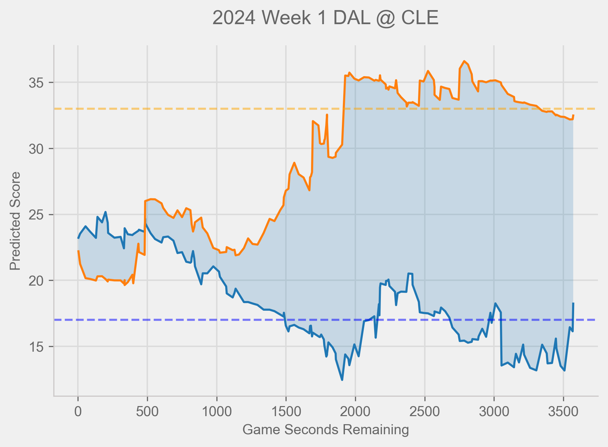

# Introduction
I've developed an Expected Points model for the NFL using PyTorch,
focusing on predicting two key metrics: home team and away team scores.
This deep learning approach provides detailed scoring predictions that can benefit multiple stakeholders in the football ecosystem.

The model's versatility makes it valuable for various applications in
professional football. Sports bettors can leverage its predictions to
make more informed wagering decisions, while coaches can use it to
better understand the point thresholds needed for victory during games.
Additionally, teams can track their performance by analyzing how their
actions influence their predicted point differential on a play-by-play
basis, providing valuable insights into their strategic effectiveness.

# Performance

The plot below demonstrates the model's real-time predictions during a 2024
Dallas Cowboys versus Cleveland Browns game, illustrating how the expected
score evolved throughout the match. Individual plays can dramatically
impact the predicted final score, highlighting the dynamic nature of
football and how single moments can shift the game's trajectory. Notably,
after halftime, the model's predicted score closely aligned with the actual
final result, suggesting strong predictive accuracy once sufficient game data was available.

